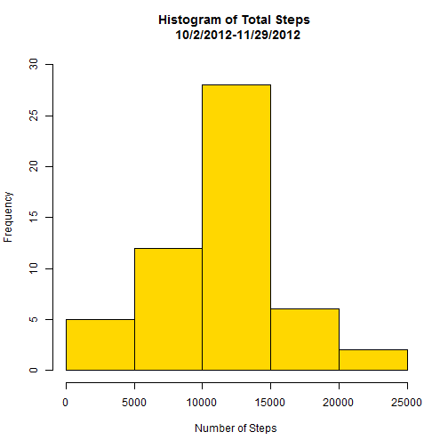
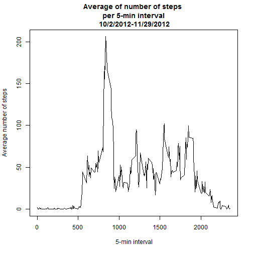
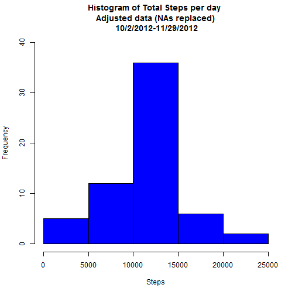
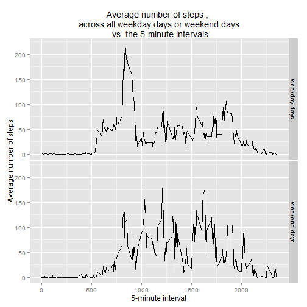

## R Markdown

This is an R Markdown presentation. Markdown is a simple formatting syntax for authoring HTML, PDF, and MS Word documents. For more details on using R Markdown see <http://rmarkdown.rstudio.com>.

When you click the **Knit** button a document will be generated that includes 
both content as well as the output of any embedded R code chunks within the document.


This R code and the corresponding markdown file relates to 
the Peer Assessment 1 of course Replicable Research of
the Data Management Specialization, 


The data is: Activity monitoring data

The link to the zip file is: 
https://d396qusza40orc.cloudfront.net/repdata%2Fdata%2Factivity.zip [52K]

Packages that must be installed and loaded before running the code:

plyr

dplyr

ggplot2

curl


```r
# Loading packages

library(plyr)
library(dplyr)
```

```
## 
## Attaching package: 'dplyr'
## 
## The following objects are masked from 'package:plyr':
## 
##     arrange, count, desc, failwith, id, mutate, rename, summarise,
##     summarize
## 
## The following objects are masked from 'package:stats':
## 
##     filter, lag
## 
## The following objects are masked from 'package:base':
## 
##     intersect, setdiff, setequal, union
```

```r
library(ggplot2)
library(curl)
```


The first part of the code will:

1. Download the data
2. Unzip the downloaded data
3. Write the data in the working directory with the name "activity.csv"


```r
tempzip<- tempfile()
curl_download("https://d396qusza40orc.cloudfront.net/repdata%2Fdata%2Factivity.zip", tempzip)
data<- read.csv(unz(tempzip,"activity.csv"))
unlink(tempzip)
write.csv(data, "activity.csv")
```


The following part code will:

1. Read the file "activity.csv"
2. Removes missing values (NAs) and create a tidy dataset called "lee1"
3. Subsets lee1 into date_steps

"lee"  is the data frame that contains the raw data.

"lee1" is the data frame that contains the tidy data 
where NAs have been removed.

The variables in the datasets are:

1. Steps
2. Date
3. Interval (5-minute interval)

There are zero values in the data.

The zero values have been considered as "no steps" taken and 
therefore a valid measurement


```r
# Reading the raw data
lee<-read.csv("./activity.csv")

# Removing the NAs values. Tidy data.
lee1<- lee[complete.cases(lee),]

#Subsetting the tidy data
date_steps<- lee1[, c("date", "steps")]
```


The following part of the code:

1. Calculates the total number of steps taken each day
2. Plots a histogram of the total number of steps taken each day
3. Calculates and reports the mean and the median of 
the total number of steps taken each day


```r
# Total number of steps per day

TotalxDate<- aggregate(date_steps$steps, by=list(date_steps$date), sum)
names(TotalxDate)<- c("Date", "Total steps")

# Histogram of the total number of steps taken each day

hist(TotalxDate[,2], col = "gold", main = "Histogram of Total Steps \n 10/2/2012-11/29/2012", 
     xlab = "Number of Steps", ylim = c(0,30))
```

 

```r
# Mean and median of the total number of steps taken per day

media<- mean(TotalxDate[,2])
mediana<- median(TotalxDate[,2])

cat(" Mean of the total number of steps taken per day  ", media , "steps", "\n Median of the total number of steps taken per day  ", mediana , "steps")
```

```
##  Mean of the total number of steps taken per day   10766.19 steps 
##  Median of the total number of steps taken per day   10765 steps
```


The following part of the code responds to the question:

What is the average daily activity pattern?

The average number of steps taken (averaged across all days), is plotted


```r
# From the original tidy data lee1, the column "interval" is set as "numeric"
# A new dataset is then created called "b"

lee1$interval<- as.numeric(lee1$interval)

b<- lee1 %>% group_by(interval) %>% summarise(ave = mean(steps))

plot(b, type="l", ylab= "Average number of steps", 
     xlab =" 5-min interval", main = "Average of number of steps \n per 5-min interval \n 10/2/2012-11/29/2012", cex = 0.7)
```

 


The next part of the code responds to the question:

Which 5-minute interval, on average across all the days in the dataset, 
contains the maximum number of steps?


```r
rank_max<- b[b$ave == max(b$ave),]
intervalo<- rank_max[1,1]
maximo<- rank_max[1,2]

cat(" The maximum number of steps on average across \n all the days in the database is in the interval", as.numeric(intervalo), "\n \n The maximum value is ", as.numeric(maximo), "steps")
```

```
##  The maximum number of steps on average across 
##  all the days in the database is in the interval 835 
##  
##  The maximum value is  206.1698 steps
```


The following part of the code:

1. Calculates and reports the number of missing values in the dataset (lee)

2. Replaces the missing value with the average number of steps in the 
corresponding interval and therefore creating a new data set calle "dd". 
The new dataset is equal to the original dataset but 
with the missing data filled in.

3. Makes a histogram of the total number of steps taken each day

4. Calculates and reports the mean and median of the 
total number of steps taken per day. 

5. Compares the mean and median of the dataset with and 
witout replacing the mising values (NAs)

6. Answers to the question: "Do these values differ from 
the estimates from the the mean and median of the tidy dataset 
without the missing value part of the assignment?"

7. Answers to the question: "What is the impact of imputing 
missing data on the estimates of the total daily number of steps?"


```r
#The total number of missing values in the dataset 

missing<- nrow(lee)-nrow(lee1)

cat("The number of missing values is ", missing)
```

```
## The number of missing values is  2304
```

```r
# Filling in all of the missing values in the dataset with the mean for that 5-minute interval across all days 

c<- select(b, interval, ave)
d<- cbind(lee, c$ave)
colnames(d)[5]<- "Average"

# Creating a new dataset that is equal to the original dataset but 
#with the missing data filled in.

dd<-d   #duplicating d
cc<- c(which(is.na(dd$steps))) #row index of the NAs
dd$steps<- as.numeric(as.character(dd$steps))
dd$steps[cc]<- dd$Average[cc]


#Histogram of the total number of steps taken each day

ddgroupy<- dd %>% group_by(date) %>% summarise(total_steps = sum(steps))
hist(ddgroupy$total_steps, col = "blue", main = "Histogram of Total Steps per day \n Adjusted data (NAs replaced) \n 10/2/2012-11/29/2012", xlab= "Steps", ylim=c(0,40)) 
```

 

```r
# Mean and median of the dataset with replaced values

mediana1<- median(ddgroupy$total_steps)
media1<- mean(ddgroupy$total_steps)

cat(" The dataset with the replaced missing value with the average steps per interval \n across all days gives the following information: \n \n","Mean =", media1, "\n", "Median = ", mediana1)
```

```
##  The dataset with the replaced missing value with the average steps per interval 
##  across all days gives the following information: 
##  
##  Mean = 10766.19 
##  Median =  10766.19
```

```r
#Comparison of the mean and median of the two datasets

compare_stat<-rbind(c(media, mediana), c(media1, mediana1))

rownames(compare_stat)<- c("Removing NAs from data", "Replacing NAs by mean value")
colnames(compare_stat)<- c("Mean", "Median")
print(compare_stat)
```

```
##                                 Mean   Median
## Removing NAs from data      10766.19 10765.00
## Replacing NAs by mean value 10766.19 10766.19
```

```r
# Answers: 
# There are no differences between the means and the medians 
# when the missing values are replaced with the average number of steps per interval

# The effect of replacing the NAs with the average number of steps per interval 
# is that the distribution is more concentrated around the mean. 
```


The following part of the code:

1. Makes a panel plot containing a time series plot (i.e. type = "l") of the 5-minute interval (x-axis) and the average number of steps taken, averaged across all weekday days or weekend days (y-axis). 

2. Answer the question: Are there differences in activity patterns 
between weekdays and weekends?

3. Answers the question: "What this plot should look like using 
simulated data?"


```r
dd$date<- as.Date(dd$date) # defining "date" as date class
zz<- mutate(dd, day_of_the_week = weekdays(date))
we<- c(which(zz$day_of_the_week=="Sunday", zz$day_of_the_week=="Saturday"))
wd<- c(which(zz$day_of_the_week !="Sunday", zz$day_of_the_week !="Saturday"))

zz[wd, "day_of_the_week"]<- "weekday days"
zz[we, "day_of_the_week"]<- "weekend days"

zz<- zz %>% group_by(interval,day_of_the_week) %>% summarise(ave = mean(steps))

qplot(interval, ave, data = zz, facets = day_of_the_week ~., bindwith =2, geom = c("line"), ylab="Average number of steps", xlab = "5-minute interval", main= "Average number of steps , \n across all weekday days or weekend days \n vs. the 5-minute intervals" )
```

 

```r
# Answer:
# there are differences in the pattern after the interval 500. Steps taken during Weekend days seem to be more volatile (greater standard deviation)

#what this plot should look like using simulated data? The plot should look 
#similar because a large number of data has been used.
```
